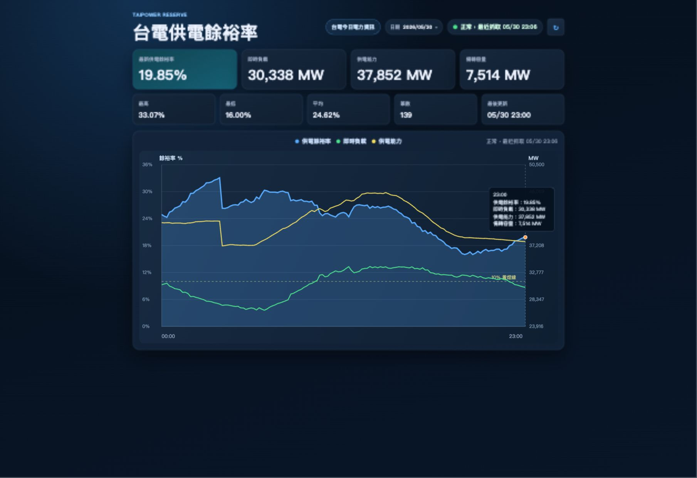

# 台電供電餘裕率追蹤

TypeScript 全棧網頁服務，每 10 分鐘抓取台電官方資料，記錄即時供電餘裕率、即時負載、供電能力與備轉容量，並以整天曲線呈現。



## 公開網址

[https://taipowercodex.zeabur.app/](https://taipowercodex.zeabur.app/)

## 功能

- 顯示指定日期的供電餘裕率整天曲線。
- 同圖顯示供電餘裕率、即時負載、供電能力。
- 顯示最新值、最高、最低、平均、筆數與最後更新時間。
- 日期選擇器會將沒有資料的日期顯示為灰色。
- 前端每 1 分鐘刷新，後端每 10 分鐘抓取一次資料。
- 抓取失敗時保留既有資料，並顯示最近抓取狀態。
- 使用 PostgreSQL 保存資料，服務重啟或重新部署後不會遺失歷史資料。

## 資料來源

主要資料來源是台電官方開放資料：

[https://service.taipower.com.tw/data/opendata/apply/file/d006020/001.json](https://service.taipower.com.tw/data/opendata/apply/file/d006020/001.json)

預設備援來源：

- [https://www.taipower.com.tw/d006/loadGraph/loadGraph/data/loadpara.json](https://www.taipower.com.tw/d006/loadGraph/loadGraph/data/loadpara.json)
- [https://www.taipower.com.tw/2289/2363/2367/2368/10266/normalPost](https://www.taipower.com.tw/2289/2363/2367/2368/10266/normalPost)
- [https://www.taipower.com.tw/2289/2363/2367/2368/10265/normalPost](https://www.taipower.com.tw/2289/2363/2367/2368/10265/normalPost)

若台電官方站台回傳 WAF challenge 或暫時無法解析，系統不會改抓第三方來源。

## 計算方式

本專案顯示的是「即時供電餘裕率」，不是台電預估尖峰備轉容量率。

```text
供電餘裕率 = (供電能力 - 即時負載) / 供電能力 × 100%
```

使用欄位：

- `curr_load`：即時負載。
- `real_hr_maxi_sply_capacity`：即時供電能力。
- `publish_time`：資料發布時間。

## API

| 路徑 | 說明 |
| --- | --- |
| `/api/latest` | 最新成功資料與最近抓取狀態。 |
| `/api/today` | 今天的資料點與統計。 |
| `/api/today?date=YYYY-MM-DD` | 指定日期的資料點與統計。 |
| `/api/dates?month=YYYY-MM` | 指定月份中有資料的日期。 |
| `/api/status` | 服務診斷狀態。 |
| `/api/debug` | 與 `/api/status` 相同，用於線上除錯。 |
| `/healthz` | 健康檢查。 |

## 本機開發

```bash
npm install
npm run dev
```

開啟：

```text
http://localhost:3000
```

正式模式：

```bash
npm run build
npm start
```

未設定資料庫時，資料會存到 `data/reserve-readings.json`。

## Zeabur 部署

1. 將此專案推到 GitHub。
2. 在 Zeabur 建立 Project，加入 Node.js Service。
3. 在同一個 Project 加入 PostgreSQL Service。
4. 確認 Node.js Service 有 PostgreSQL 自動注入變數。
5. Zeabur 依照 `package.json` 執行 build 與 start。

建議環境變數：

| 變數 | 建議值 | 說明 |
| --- | --- | --- |
| `NODE_ENV` | `production` | 正式環境。 |
| `COLLECT_INTERVAL_MS` | `600000` | 每 10 分鐘抓一次。 |
| `DATABASE_SSL` | `false` | Zeabur 內部 PostgreSQL 通常不需要 SSL。 |
| `DATABASE_CONNECT_TIMEOUT_MS` | `3000` | 資料庫連線逾時。 |
| `DATABASE_INIT_MAX_ATTEMPTS` | `3` | 啟動時資料庫連線重試次數。 |
| `DATABASE_INIT_RETRY_DELAY_MS` | `1000` | 啟動時資料庫重試間隔。 |

資料庫連線會優先使用 Zeabur 自動注入的分項變數，例如 `POSTGRES_HOST`、`POSTGRES_USERNAME`、`POSTGRES_PASSWORD`、`POSTGRES_DATABASE`。若沒有分項變數，才使用 `DATABASE_URL`、`POSTGRES_URI` 或 `POSTGRES_CONNECTION_STRING`。

## 測試

```bash
npm test
```

測試內容包含設定解析、資料去重、日期查詢、台電 JSON 解析與即時供電餘裕率重算。
